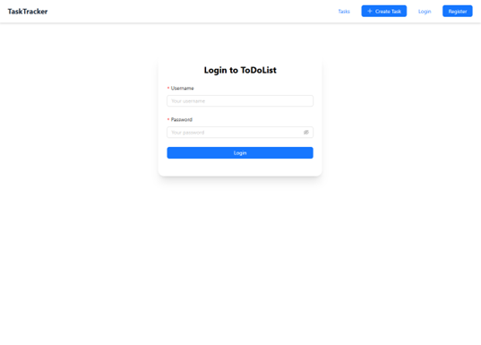
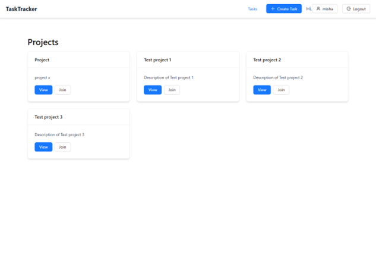
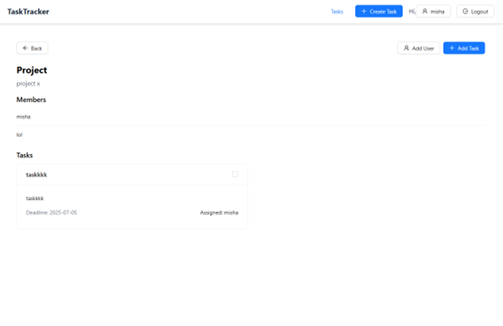
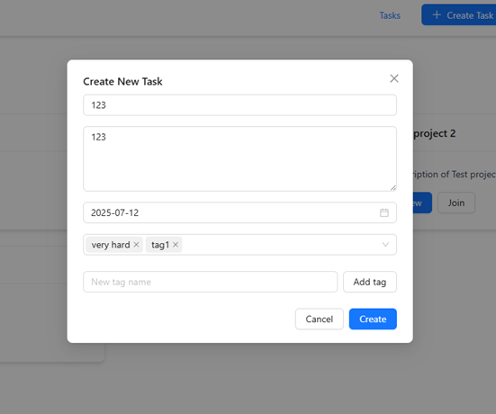
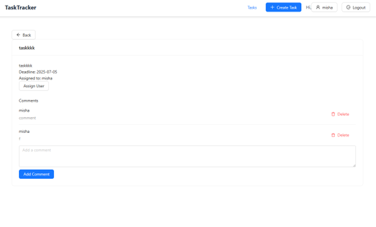

# 📝 Task Tracker — Fullstack To-Do App
Task Tracker — это современное веб-приложение для управления проектами и задачами.
Пользователи могут создавать проекты, добавлять задачи, назначать участников, устанавливать дедлайны и оставлять комментарии.

Приложение разработано на FastAPI (Python) для бэкенда, React (Vite) для фронтенда и PostgreSQL для базы данных.

## 🚀 Стек технологий
### 🧠 Backend
Python 3.12  
FastAPI — фреймворк для создания RESTful API  
SQLAlchemy — ORM для работы с PostgreSQL  
Passlib / JWT — для аутентификации и хеширования паролей  
Uvicorn — ASGI-сервер для запуска FastAPI  
### 💻 Frontend
React (Vite) — быстрая сборка и разработка  
Tailwind CSS — для стилизации интерфейса  
Ant Design — библиотека готовых UI-компонентов  
Axios — для работы с API  
### 🗄 Database
PostgreSQL — реляционная база данных  
ER-модель содержит сущности:  
User, Project, Task, Comment, Tag, Assignment  
## ⚙️ Функционал приложения
✅ Регистрация и авторизация пользователей  
✅ Создание и управление проектами  
✅ Добавление задач и установка дедлайнов  
✅ Привязка тегов к задачам  
✅ Назначение пользователей на задачи  
✅ Комментирование задач  
✅ Отметка о выполнении задач  
✅ Просмотр всех проектов и задач на отдельных страницах  
## 🧩 Архитектура
Приложение реализует клиент-серверную архитектуру с REST API.  
Backend — обрабатывает бизнес-логику, взаимодействует с БД.  
Frontend — отображает интерфейс и взаимодействует с API.  
CORS настроен для обмена данными между портами 8000 (FastAPI) и 5173 (React).  
Frontend (React)  --->  REST API (FastAPI)  --->  Database (PostgreSQL)  

## 🛠 Установка и запуск
1️⃣ Клонирование репозитория  
git clone https://github.com/username/todo-list.git  
cd todo-list  

2️⃣ Настройка backend (FastAPI)  
cd todo-list-backend  
python -m venv venv  
venv\Scripts\activate  

Запуск сервера:  
uvicorn main:app --reload  

Сервер запустится по адресу:  
👉 http://127.0.0.1:8000/docs  
 — Swagger UI  

3️⃣ Настройка frontend (React)  
cd todo-list-frontend  
npm install  
npm run dev  

Интерфейс будет доступен по адресу:  
👉 http://localhost:5173/  

## 📸 Скриншоты интерфейса

